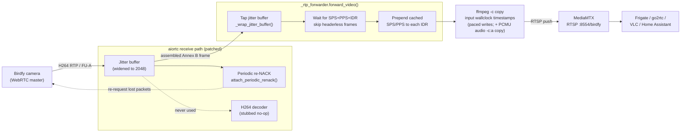
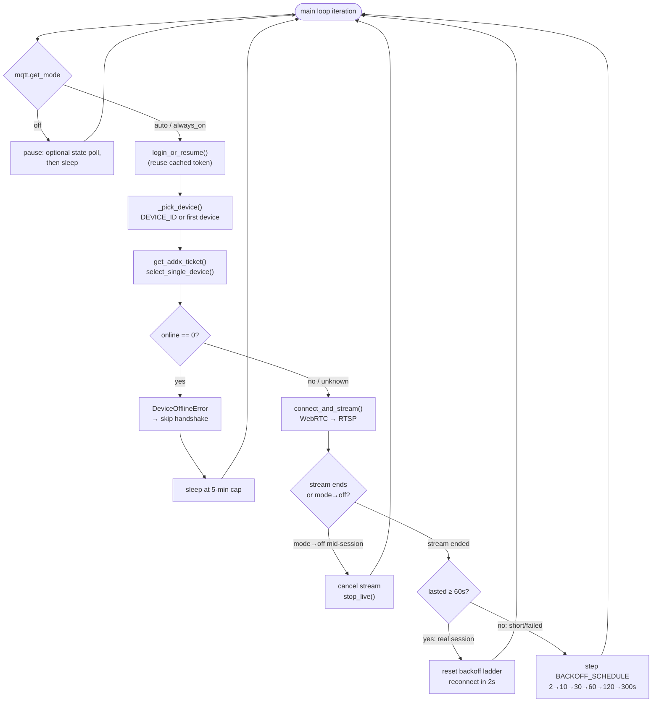

# How it works

The Birdfy / Netvue cloud API uses a custom auth scheme reverse-engineered from the `my.birdfy.com` web app JavaScript bundles. There are two WebRTC paths depending on device type.

## Stream pipeline (the one-glance view)

The bridge's whole job is **WebRTC in, RTSP out, no re-encode**. Bytes flow camera → aiortc's RTP receive path → an ffmpeg `-c copy` passthrough → MediaMTX → any RTSP client. The boxes below name the actual functions doing the work.



The dashed edges are the load-bearing oddities: the decoder is bypassed (it can't decode this camera's bitstream), and the re-NACK loop feeds *back* to the camera to recover dropped keyframe-head fragments. See [RTP receive-path quirks](#rtp-receive-path-quirks) for why each exists.

## Session lifecycle (connect / backoff / mode)

`main()` runs one camera session per loop iteration. Sessions drop every few minutes (camera sleep/wake) — that's normal, not an error. This is the control flow around each `run_once()`:



The 60-second bar distinguishes a real stream from a failed handshake, and the backoff ladder stops an offline camera from being polled every 2s (which would burn battery waking it). See [Operations](operations.md) and [The three modes](home-assistant.md#the-three-modes).

## Addx WebRTC path (`onAddx: true`)

1. **Auth**: `POST https://localweb.nvts.co/v1/users/login/v2`
   - Body: `{username, password: md5(password), locale: "EN"}`
   - Headers: `x-nvs-ucid: 513774810c`, `x-nvs-udid: <uuid>` (no Bearer token)
   - Response: `{token, userID, region, localEndpoint, ...}`

2. **Device list**: `GET {localEndpoint}/v1/devices/v3`
   - Headers: NVS signature chain (HMAC-SHA256, see [`birdfy_api.py::_nvs_sign`](../birdfy_api.py))
   - Response: `{devices: [{serialNumber, name, onAddx, addxSn, groupId, region, ...}]}`

3. **Addx ticket**: `GET https://api2.nvts.co/addx/token/v2` → `POST {endpoint}device/getWebrtcTicket`
   - Response ticket: `{signalServer, groupId, role, id, traceId, time, sign, iceServer:[...], signalPingInterval}`

4. **WebSocket URL** (from ticket):
   ```
   {ticket.signalServer}/{ticket.groupId}/{ticket.role}/{ticket.id}
   ?traceId={ticket.traceId}&time={ticket.time}&sign={ticket.sign}&name=a4x
   ```

5. **WebRTC negotiation** over WebSocket:
   - We (viewer) send `SDP_OFFER` — camera (master) sends `SDP_ANSWER`
   - Message format: `{messageType, recipientClientId, senderClientId, sessionId, messagePayload: base64(json({sdp, type})), viewerType: "netvue_web_sdk", mode: "vicoo"}`
   - ICE candidates use same format with `messagePayload: base64(json(candidate))`
   - Heartbeat: re-send last cached ICE candidate every `ticket.signalPingInterval` seconds

6. **Video** received as H264 via aiortc. We do **not** decode/re-encode: aiortc's
   libavcodec H264 decoder can't decode this camera's bitstream, and Frigate
   re-encodes anyway. Instead we tap aiortc's jitter buffer between depayload and
   decode, pull the reassembled Annex B frames, and pipe them to an
   `ffmpeg -c copy -f rtsp` passthrough (see [`_rtp_forwarder.py`](../_rtp_forwarder.py)).
   No decode, no re-encode. Because we never use the decoder's output, aiortc's
   video decoder is replaced with a no-op (see `BIRDFY_STUB_VIDEO_DECODE`) — this
   stops the noisy `H264Decoder() failed to decode` warnings the libavcodec
   decoder emits on this bitstream, which got louder after the `av` bump. See
   [RTP receive-path quirks](#rtp-receive-path-quirks) for the keyframe-recovery
   and timestamp fixes that make this reliable.

## KVS WebRTC path (`onAddx: false` — not yet implemented)

Some newer / outdoor Netvue cameras use AWS Kinesis Video Streams WebRTC:
- `POST {localEndpoint}/devices/{serialNumber}/play` with `provider: "KVS_WEBRTC"`
- Returns AWS credentials + channel ARN
- Requires `boto3` or the KVS WebRTC JavaScript SDK

## NVS Signature algorithm

```python
import hmac, hashlib

def nvs_sign(token, ucid, udid, userid, timestamp):
    s = hmac.new(("nvs1" + token).encode(), ucid.encode(), hashlib.sha256).hexdigest()
    s = hmac.new(s.encode(), udid.encode(), hashlib.sha256).hexdigest()
    s = hmac.new(s.encode(), userid.encode(), hashlib.sha256).hexdigest()
    s = hmac.new(s.encode(), timestamp.encode(), hashlib.sha256).hexdigest()
    return hmac.new(s.encode(), b"nvs1_request", hashlib.sha256).hexdigest()
```

Required headers for all authenticated API calls:
```
x-nvs-ucid:      513774810c
x-nvs-udid:      <any stable UUID>
x-nvs-userid:    <userID from login>
x-nvs-time:      <unix timestamp milliseconds as string>
x-nvs-signature: <nvs_sign(token, ucid, udid, userid, time)>
x-nvs-version:   {"signature":2}
```

## SDP / ICE / DTLS quirks

The camera's WebRTC stack rejects several things aiortc emits by default. See [`_sdp_patches.py`](../_sdp_patches.py) and [`_aioice_patches.py`](../_aioice_patches.py) for the rewrites and runtime patches — each one is necessary and load-bearing; do not "clean them up" without consulting the pcap evidence referenced in the comments.

## RTP receive-path quirks

Two more load-bearing fixes live in [`_aiortc_media_patches.py`](../_aiortc_media_patches.py) and [`_rtp_forwarder.py`](../_rtp_forwarder.py); both were confirmed against captured logs.

### Keyframe corruption (garbage frames with no start code)

The camera's keyframes are large (~25–52 KB ≈ 50–110 RTP packets of FU-A fragments). aiortc's video jitter buffer defaults to `capacity=128`, so one keyframe nearly fills it; any reorder or a not-yet-recovered lost packet evicts the **head** of the keyframe (the FU-A start fragment carrying the NAL header + Annex B start code), and the surviving fragments reassemble into headerless garbage that nothing can decode. aiortc also NACKs a missing packet only **once** and only tracks gaps within `RTP_HISTORY_SIZE=128`.

`_aiortc_media_patches.py` fixes this by (1) widening the video jitter buffer (128 → 2048), (2) widening the NACK tracking window (128 → 1024), and (3) adding a **periodic re-NACK** loop per video receiver that re-requests still-missing sequence numbers until they arrive — which is what actually recovers a dropped keyframe-head fragment. All four parameters are env-tunable (see [Configuration](configuration.md)). It also logs the camera's advertised RTCP feedback (whether `nack` is supported), every re-NACK, and a per-session corruption tally for debugging.

### Stream timestamps (broken timing → Frigate fps-cap kill / A/V drift)

The raw Annex B stream we feed ffmpeg under `-c copy` carries no container timing, so the passthrough must synthesize it. Two approaches were tried and abandoned:

- **Arrival wall-clock on raw packets.** NACK-recovered/reordered frames arrive out of order, so DTS went backwards (`Non-monotonous DTS`) and the stream looked like ~30 fps to Frigate — its fps-cap watchdog killed the reader, tearing down the RTSP session, breaking ffmpeg's pipe, dropping the MediaMTX path, and cascading into `404 Not Found` on Frigate's restart.
- **Fixed-CFR `setts`** (`setts=pts=N*K:dts=N*K:time_base=1/90000`, `K = 90000/BIRDFY_FRAME_RATE`). Strictly monotonic and it cleared the muxer stall, but it labels every frame exactly `1/FRAME_RATE` apart — a *different clock* from the audio, which ffmpeg paces off its true 8 kHz µ-law sample count (≈ real wall-clock). The camera's real delivered rate wobbles (~8.6 fps measured, autoBitrate-driven) and never equals `FRAME_RATE`, so the video media clock ran ~4.5% fast against audio and **A/V drifted apart by minutes** over a long session.

Current approach (`_rtp_forwarder.py`): drive **both** streams off the same real wall-clock. ffmpeg uses `-use_wallclock_as_timestamps 1` on the video input, stamping each frame at the instant it *reads* it from the pipe; `forward_video` paces each stdin write to the frame's own monotonic jitter-buffer completion time (the `pace_anchor` logic). Because we write fully assembled frames in decode order (the jitter buffer already reorders), and pace them to true completion times, ffmpeg's read-time is monotonic **and** spaced at the real delivery cadence — no DTS inversion, no muxer stall, and on the **same** clock as the audio sample count, so A/V can't drift. `BIRDFY_FRAME_RATE` no longer affects A/V sync; it only seeds the demuxer's initial fps guess (`-r`).

> Downstream, point Frigate at the bridge per [Pointing Frigate at the bridge](frigate.md): hardware-decode the full-res stream rather than re-encoding a go2rtc detect substream, which avoids reintroducing the same fps-cap teardown on the substream hop.
